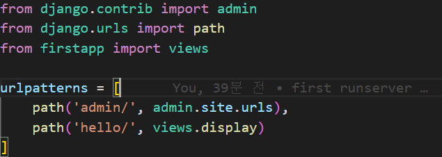
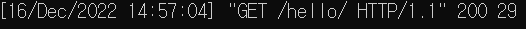

## Configure Application
(1) settings.py 를 이용해 application을 구성한다.
- settings.py의 INSTALLED_APPS에 firstapp을 추가한다.
(2) views.py를 이용해 첫 번째 View를 구성한다.
- requests를 받고 HTTP response를 돌려주는 역할
- View를 보여주는 display함수를 생성한다.

## Configure URL
(1) urls.py를 이용해 views.py 모듈에서 URL을 구성한다.
- urls.py에서 view.py를 사용하기 위해 from firstapp import views 구문을 추가한다.
- /hello 라는 url을 추가하기 위해 urlpattern에 views.display를 추가한다.
<<<<<<< HEAD

=======

>>>>>>> 49d2fdead603e336bc60189b8a501c5be8b97c19
request의 URI를 통해 GET /hello 를 받았고, 웹 브라우저를 통해 response를 확인할 수 있다.
 

 
urls.py 파일에서 path(URL, URI) 메소드를 통해 특정 URI를 매핑시키는 URL Config를 구성할 수 있다.

