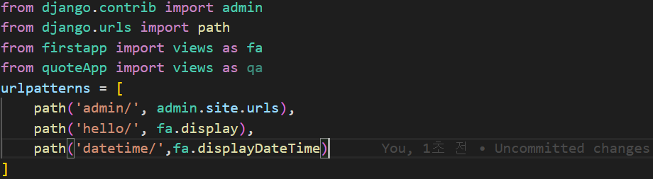
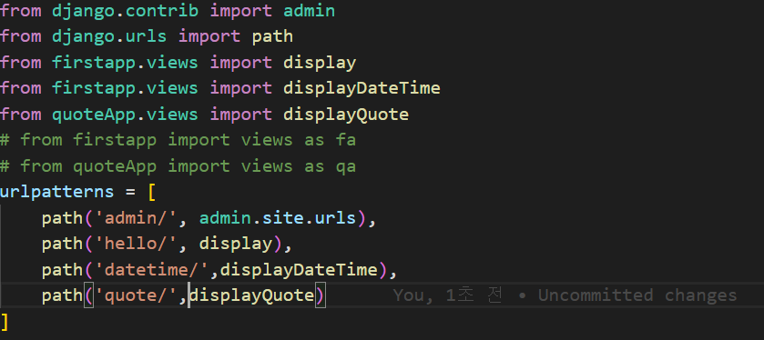

## Multiple Application in a Project
(1) quoteApp이라는 새 App을 실행
```
$ python manage.py startapp quoteApp
```
- settings의 INSTALLED_APPS에 quoteApp을 추가
- display하는 displayQuote함수 구성 => views.py
(2) url.py를 구성
- 똑같이 app으로부터 View를 import하지만, firstapp으로부터 import한 View나 quoteApp으로부터 import한 View나 같은 View이기 때문에 식별하는데 어려움이 있다. 따라서 as fa, as qa로 바꿔준다.

- 그 후 새로운 URL Pattern을 define한다.
(3) 모듈 관리를 더욱 깔끔하게
- as fa, as qa를 쓰기 보다는 from {app_name}.{file_name} import {function_name}으로 바꿔준다.



Project에서 Multiple Application을 hosting할 수 있다.

